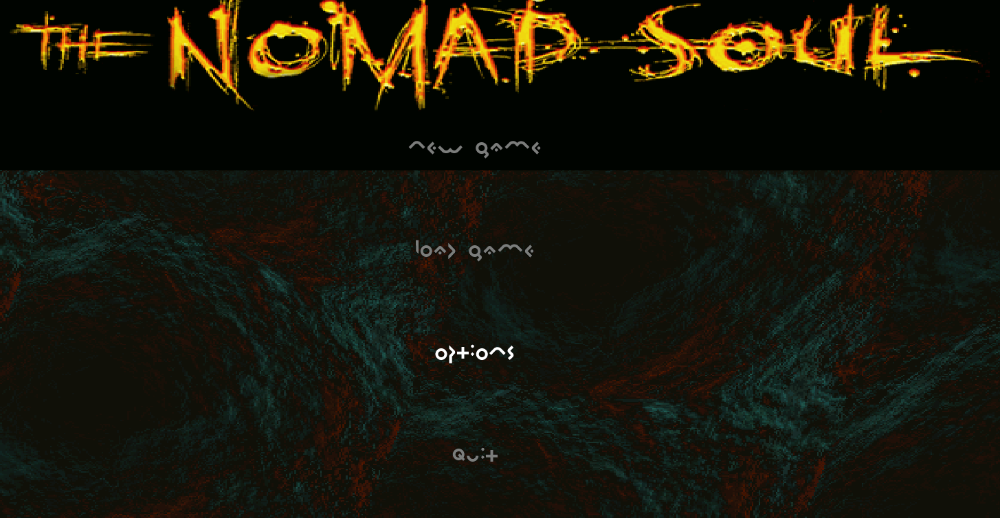

_Built with godot 3.5.3_

# What's this?

This is a tool for the game Omikron the nomad soul.

It replaces the unreadable Omikron font with the much more readable journal font in menus and books.

Here's some pictures for comparison:

|| Before | After |
|----|--------|-------|
|Main Menu|||
|Pause Menu|||
|Multiplan/Sneak Documents|||

# How to use it

Download the latest release for your OS from here https://github.com/Klius/readable-omikron/releases

- Open the app and select the folder where omikron the nomad soul is installed.
- Click on "Replace font"
- Look at the logs to see if it was succesful

